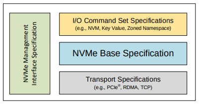
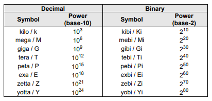
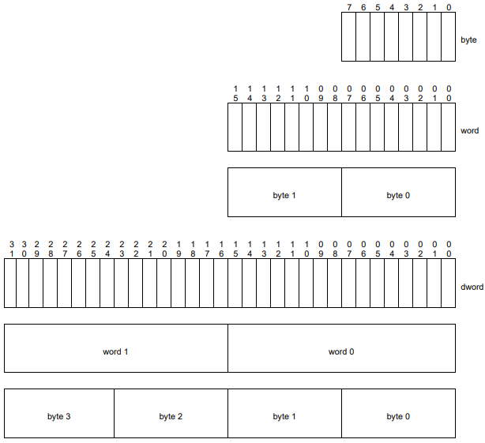

### NVMe 개요
Non-volatile Memory Express 의 약자
PCIe, 이더넷, InfiniBand, 파이버 채널을 사용하여 연결된 모든 스토리지 솔루션에 최적화 되어 있음

### NVMe 스펙들

NVMe는 NVMe Base, Management Interface, I/O Command Set, Transport 과 같이 4가지 spec이 있음

* NVMe Base specification
호스트 소프트웨어와 비휘발성 메모리 서브시스템 간의 메모리 기반(memory-based) 전송 및 메시지 기반(message-based) 통신 프로토콜을 정의 함

* NVMe Management Inteface (NVMe-MI) specification
모든 NVMe 서브시스템에 대한 관리 인터페이스를 정의함

* NVMe I/O Command Set specification
NVMe Base spec에서 확장된 데이터 구조, 기능, 로그 페이지, 명령, 상태 변수를 정의함

* NVMe Transport specification
컨트롤러 요소들(controller properties)과 NVMe 프로토콜을 특정 전송 수단에 바인딩 하는 것을 정의함

### 범위

NVMe 스펙은 컨트롤러가 NVM 서브시스템과 통신하기 위한 인터페이스로 구성된 속성들(properties)과 명령어 집합(command set)을 정의 해야 함

여기서 말하는 컨트롤러는

1. I/O 컨트롤러
1. 검색 컨트롤러(Discovery controllers)
1. 관리 컨트롤러(Administrative controllers)

위의 3가지로 구분되며 각각 다른 기능을 가짐
근데.. 이 문서에서는 일반적으로 각 컨트롤러의 구분이 어렵지 않은 이상 그냥 컨트롤러 라고 부르는 듯 함

### 용어

* mandatory

스펙 문서에 나와 있는대로만 구현 해야 하는 항목을 나타냄

* may

선택의 유연성을 가질 수 있다..?

* obsolete

이전 버전에는 정의 되어 있었으나 이번 버전에서는 삭제된 기능을 뜻 함

* optional

이번 버전에서 반드시 필요한건 아니지만 만약 정의된 내용이 있다면 그 정의 대로 구현되어야 하는 기능
레거시 호환 그런건가??

* R

아래의 `reserved` 와 뜻은 같음. 그냥 칸 모자라서 `reserved`라고 못 쓸때 사용

* reserved

향후 표준화를 위해 별도로 남겨둔 비트 / 바이트 / word / field / opcode

* shall

상호 운용성을 보장 하기 위해 반드시 구현 해야 하는 필수 요구 사항을 나타냄
mandatory.. 와 뜻은 비슷한듯

* should

강력하게 권장될때 사용

* 숫자에 대하여

일반적으로 명시되지 않는 한 값은 1부터 시작 (1h는 1h의 값 2h는 2h의 값)
여기서 나오는 h는 16진수 hex를 뜻함

`^`는 거듭 제곱을 뜻함

매개변수가 ASCII 문자열로 정의 되어있을 경우 문자열은 20h ~ 7Eh 만 포함 되어야 함
이 문자열은 왼쪽 정렬되며 필요한 경우(지정된 길이보다 작거나 할때 패딩?) 나머지 오른쪽에 20h(` `)로 채워짐

16진수를 ASCII 문자열로 표기할 때는 0~9, A~F 혹은 a ~ f 로 나타냄
8자 이상의 16진수를 표기 할 때에는 8자마다 _를 붙여서 나타냄 (1E_DEADBEEFh)

2진수를 나타낼때에는 접미사 `b`를 붙여 표기함
4자 이상의 2진수를 나타낼때에는 4자마다 _를 붙여 표기 (1000_0101_0010b)

그외 모든 숫자는 10진수임
소수를 구분할땐 `.`을 사용하고 연도가 아닌 숫자에는 1000단위 구분 쉼표가 들어감

* Byte Word Dword의 관계

byte : 8bit

word : 2byte

dword: 2word (4byte)

### 정의

* 관리 큐(Admin queue)

구분자가 0인 제출 큐(Submission Queue, 호스트에서 보낸 명령어를 컨트롤러에 전송하는 큐)와 완료 큐(Completion Queue,컨트롤러가 처리한 명령어의 완료를 알리는 큐)

Admin Submission Queue는 관리 명령(administrative commands)을 제출하고
Admin Completion Queue는 관리 명령이 완료됨을 알림

* 관리 컨트롤러(Administrative controller)

호스트가 NVM 서브시스템을 관리할 때 사용할 수 있도록 된 컨트롤러
I/O 큐가 없고 비휘발성 메모리의 사용자 데이터 및 메타 데이터에 접근할 수 없으며 이름 공간(namespaces)을 지원하지 않음
이름 공간이 없으므로 NSID도.. 없다고 함..

* arbitration burst

중재 매커니즘(arbitration mechanism)이 제출 큐에서 가져올 수 있는 최대 명령 수

* 중재 매커니즘(arbitration mechanism)

컨트롤러가 실행할 명령을 가져올 다음 제출 큐를 결정하는 방법

* association

I/O 큐와 관리 큐를 포함한 특정 컨트롤러와 특정 호스트간의 배타적 통신 관계

* audit

소독(sanitize) 작업의 올바른 작업을 결정하기 위해 매체(media)에 접근하는 프로세스

* 인증 명령(authentication commands)

Fabrics Authentication Send / Authentication Receive 명령을 참조 할때 사용

* cache

NVM 서브시스템에서 사용하는 비휘발성 매체에 저장된 사용자 데이터의 부분이나 아직 저장(commit)되지 않은 데이터를 저장하는 데이터 저장영역

* 후보 명령 (candidate command)

컨트롤러로 전송된 명령, 컨트롤러는 후보 명령들을 준비가 된 것으로 간주함

* 캡슐 (capsule)

NVMe over Fabrics 에서 사용되는 NVMe 정보 교환 단위
캡슐은 명령 / 응답을 담고 있으며 명령 / 응답 데이터와 SGL(Scatter Gather List)을 담을 수도 있음

* 채널 (Channel)

컨트롤러와 NVM 서브시스템 내의 하나 이상의 매체 장치(Media Units)간의 통신 경로

* 명령 완료 (command completion)

컨트롤러가 명령을 완전히 처리 후, 완료 큐 항목의 상태 정보를 갱신하고 관련된 완료 큐에 게시(posted)하면 명령이 완료됨

* 명령 제출 (command submission)

PCIe와 같은 메모리 기반 전송 모델에서의 명령 제출은
제출 큐 Tail Pointer 값이 제출 큐를 지나갈때 제출 큐 Tail Doorbell 쓰기를 완료함으써 명령이 제출됨

NVMe over Fabrics 와 같은 메시지 기반 전송 모델에서는
호스트가 제출 큐에 캡슐을 추가하면 명령이 제출됨

* 컨트롤러

NVM 서브시스템과 호스트간의 인터페이스를 말함
맨 첨에 나왔듯이 I/O 컨트롤러, 검색 컨트롤러, 관리 컨트롤러 3가지로 이루어져 있음

제출 큐에서 호스트가 제출한 명령을 실행하고 완료 큐에 완료 됨을 게시함
모든 컨트롤러는 하나의 관리 큐와 하나 이상의 I/O 제출 큐 및 I/O 완료 대기 큐를 가짐

전송 사양을 PCIe로 사용할 경우 컨트롤러는 PCIe의 기능임

* 지시 (directive)

호스트 와 NVM 서브시스템 / 컨트롤러 사이의 정보 교환 방법
Directive Send / Directive Receive 명령을 사용하요 정보를 전송 할 수 있음
I/O 명령어 셋(I/O Command Set)에 있는 명령들은 Direcive Type과 Directive Specific 필드가 포함될 수 있음

* 검색 컨트롤러 (Discovery controller)

호스트가 Discovery Log Page 를 검색할 수 있는 기능을 사용할 수 있도록 해주는 컨트롤러
I/O 큐나 비휘발성 저장장치에 대한 접근은 할 수 없음

* 검색 서비스 (Discovery Service)

검색 컨트롤러만 지원하는 NVM 서브시스템
이름 공간을 제공하는 컨트롤러는 사용할 수 없음

* 동적 컨트롤러(dynamic controller)

컨트롤러는 상태를 가지지 않으며 요청에 따라 할당됨..????
The controller is allocated on demand with no state (e.g., Feature settings) preserved from prior associations.

* 도메인

전원 상태, 용량 정보와 같은 상태(state)를 공유 하는 분할할 수 없는 가장 작은 단위를 말함

* 에뮬레이트 된 컨트롤러 (emulated controller)

소프트웨어로 정의된 NVMe 컨트롤러
에뮬레이트 된 컨트롤러는 실제 물리적인 NVMe 컨트롤러가 있거나 없을 수도 있음
.. NVMe 장치가 있어야지만 사용할 수 있다는 뜻은 아닌듯?

* 내구도 그룹 (Endurance Group)

내구도를 그룹으로 관리하는 NVM 서브시스템의 비휘발성 메모리의 묶음

* 패브릭 (fabric, network fabric)

노드간 데이터를 전달하는 네트워크 토폴로지

* firmware/boot partition image update command sequence

펌웨어 / 부트 이미지를 다운로드한 후 펌웨어 슬롯 / 부팅 파티션에 커밋하는 일련의 과정

* 펌웨어 슬롯 (firmware slot)

펌웨어 이미지를 저장하는데 사용되는 도메인의 위치
한 도메인에서 1~7개의 펌웨어 이미지를 저장하면 같은 도메인의 컨트롤러들은 펌웨어 슬롯을 공유함

* 호스트 (host)

하나 이상의 컨트롤러를 통해 NVM 서브시스템의 제출 큐에 명령을 제출하고 완료 큐에서 명령 완료를 검색하는 개체

* host-accessible memory

말 그대로 호스트가 접근 가능한 메모리
host memory, Controller Memory Buffer (CMB), Persistent Memory Region (PMR) 등이 있음

* host memory

호스트와 컨트롤러에서 모두 읽고 쓸 수 있으며 컨트롤러에 의해서 보여지는 메모리가 아닌 메모리
호스트 내부 외부 상관없이 있을 수 있음

* 컨트롤러 데이터 구조 식별 (Identify Controller data structures)

All controller data structures that are able to be retrieved via the Identify command: Identify Controller data
structure (i.e., CNS 01h) and each of the I/O Command Set specific Identify Controller data structure (i.e.,
CNS 06h).

* 이름 공간 데이터 구조 식별 (Identify Namespace data structures)

All namespace data structures that are able to be retrieved via the Identify command: Identify Namespace
data structure (i.e., CNS 00h), I/O Command Set Independent Identify Namespace data structure (i.e., CNS
08h), and each of the I/O Command Set specific Identify Namespace data structures (i.e., 05h).

* I/O 명령 (I/O command)

I/O 제출 큐에 제출된 명령을 말함

* I/O 완료 큐 (I/O Completion queue)

하나 이상의 I/O 제출큐와 연결되며 지시된 명령이 완료 됨을 알리는 완료 큐

* I/O controller

I/O 제출 큐와 완료 큐(I/O queues)가 구현되어 비휘발성 메모리 저장 매체에 접근 할때 사용는 컨트롤러

* I/O 제출 큐 (I/O Submission Queue)

읽기, 쓰기 등 컨트롤러에서 실행할 I/O 명령을 제출하는데 사용되는 제출 큐

* 매체 장치 (Media Unit)

NVM 서브시스템에서 매체의 기본 구성 요소를 나타내며 내구성 그룹은 이것으로 구성됨

* metadata

데이터의 특정 LBA와 같은 정형화된 사용자 데이터와 관련된 문맥 정보(contextual information)
호스트는 컨트롤러가 제공하는 저장공간이 있다면 NVM 서브시스템에 메타데이터가 저장되도록 할 수 있음

* 이름공간 (namespace)

호스트가 직접 접근할 수 있는 정형화된 갯수의 비휘발성 메모리

* NSID (Namspace ID)

이름공간에 대한 액세스를 제공하기 위해 컨트롤러가 사용하는 식별자
혹은 SQE(Submission Queue Entry)구조체의 Identifiy 필드

* NVM

non-volatile memory의 두문자어

* NVM set

내구도 그룹에 속한 NVM 의 일부

* NVM subsystem

하나 이상의 도메인, 컨트롤러, 포트와 0개 이상의 이름공간이 포함되며
비휘발성 메모리 저장 매체와 컨트롤러 간의 인터페이스가 포함 될 수 있음

* NVM subsystem port

NVM 서브시스템과 패브릭간의 NVMe over Fabric 프로토콜 인터페이스를 말하며
단일 인터페이스처럼 동작하는 하나 이상의 물리적 패브릭 인터페이스의 모음이다

* NVMe over Fabric

메모리 기반 전송 모델의 메시지 전용(message-only) 혹은 메시지 기반 / 메모리 기반 전송 모델 중 하나를 준수하는 NVMe 인터페이스 구현

* NVMe 전송 (NVMe Transport)

호스트와 NVM 서브시스템간의 데이터, 명령, 응답을 안정적으로 전달하는 프로토콜 레이어를 말함
NVMe 전송 계층은 패브릭 위에 계층화 되며 이로 인해 패브릭과 독립적임

* NVMe Transport binding specification

호스트와 NVM 서브시스템간의 안정적인 NVMe 전송을 위한 사양
binding은 NVMe 전송에 따라 기능을 제한하거나 사용할 수 없게 만들 수도 있음

* 물리적 패브릭 인터페이스 (physical fabric interface, physical ports)

NVM 서브시스템과 패브릭간의 물리적인 연결

* Port ID

NVM 서브시스템의 포트와 관련된 식별자

* 주 컨트롤러 (primary controller)

가상화 관리 명령(Virtualization Management command) 지원하는 NVMe 컨트롤러
NVM 서브시스템에는 여러개의 주 컨트롤러가 존재할 수 있음
NVM 서브시스템의 보조 컨트롤러(Secondary controller)는 동적 자원 관리(dynamic resource management)를 위해 주 컨트롤러에 종속됨

* 전용 이름공간 (private namespace)

한번에 한 컨트롤러에서만 연결이 가능한 이름공간

* 속성 (property)

NVMe over PCIe에 정의된 메모리 맵 컨트롤러 레지스터(Memory mapped controller)의 일반화....
저수준 컨트롤러의 속성을 구성하고 상태를 얻는데에 사용 된다고 함....

* 회전 매체 (rotational media)

돌아가는 플래터들에 데이터를 저장하는 매체

* Runtime D3 (Power Removed, RTD3)

동작 중에 컨트롤러의 주 전원이 제거된 것
보조 전원은 제공되거나 제공되지 않을 수 있음
PCIe의 경우엔 RTD3는 D3cold 전원 상태임

* 소독 작업 (sanitize operation)

NVM 서브시스템에 있던 모든 사용자 데이터가 비휘발성 메모리, 캐시에서 복구 될 수 없도록 하는 작업

* 보조 컨트롤러 (secondary controller)

주 컨트롤러에 종속되어 NVM 서브시스템에서 어떤 컨트롤러 자원을 관리하기위한 NVMe 컨트롤러

* 공용 이름 공간 (shared namespace)

두개 이상의 NVM 서브시스템 컨트롤러들이 동시에 접근할 수 있는 이름공간

* 회전 종료 (spindown)

회전 매체에 데이터를 저장하고 있는 내구도 그룹에서
전원 상태를 동작 전원 상태(operational power state)에서 비동작 전원 상태(non-operational power state)로 전환 하는 작업

* 회전 시작 (spinup)

회전 매체에 데이터를 저장하고 있는 내구도 그룹에서
전원 상태를 비동작 전원 상태에서 동작 전원 상태로 전환 하는 작업

* 정적 컨트롤러 (static controller)

특정 컨트롤러 ID로 미리 존재하며 기능 설정(Feature settings)등과 같은 상태를 이전과 같이 유지하는 컨트롤러

* 사용자 데이터 (user data)

호스트가 저장하고 나중에 검색할 수 있는 이름 공간에 저장된 데이터를 말함
만약 메타데이터를 지원할 경우 그것도 사용자 데이터에 포함됨

### NVMe Base specification 에서 쓰이는 I/O Command Set specific 용어의 정의

* 내구도 그룹 호스트 읽기 명령 (Endurance Group Host Read Command)

컨트롤러가 사용자 데이터를 읽은 결과를 반환하는 I/O 명령셋의 명령
읽은 데이터는 호스트에게 반환이 될 수도 있고 안될 수도 있음

* 서식 색인 (Format Index)

User Data Format number 등과 같이 I/O 명령셋의 서식 표(Format table)에서 사용되는 색인 값

* SMART Data Units Read Command

컨트롤러가 사용자 데이터를 읽은 결과를 반환하는 I/O 명령셋에 명시된 명령
데이터를 읽은 결과는 호스트에게 반환 될 수도 있고 아닐 수도 있음

* SMART Host Read Command

컨트롤러가 사용자 데이터를 읽은 결과를 반환하는 I/O 명령셋에 명시된 명령
데이터를 읽은 결과는 호스트에게 반환 될 수도 있고 아닐 수도 있음

... NVMe 2.0b 스펙에 위 `SMART Data Units Read Command`와 설명이 토씨하나 틀리지 않음..

* 사용자 데이터 서식 (User Data Format)

NVM 매체의 데이터 계층을 설명하는 I/O 명령셋에 명시된 서식

* 사용자 데이터 방출 (User Data Out Command)

컨트롤러가 사용자 데이터를 기록 하지만
호스트에서 컨트롤러로 사용자 데이터를 전송 할 수도 있고 아닐 수도 있는 I/O 명령셋에 명시된 명령

### NVMe Base specification 에서 쓰이는 NVM Command Set 용어의 정의

* 논리 블록 (logical block)

읽기 / 쓰기 명령에서 주소로 지정 가능한 가장 작은 데이터 단위

* 논리 블록 주소(logical block address, LBA)

논리 블록의 주소를 말함, 일반적으로 LBA로 쓰임
