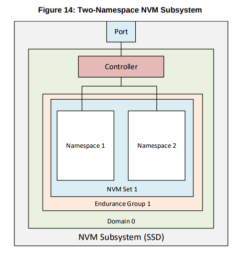

NVMe는 PCIe기반의 SSD나 패브릭으로 연결된 장치들의 인터페이스를 제공

단대단 데이터 보호(일반적으로 T10 DIF와, SNIA DIX로 알려진 표준들과 호환 가능), 강화된 오류 보고, 가상화 등과 같은 엔터프라이즈 기능들도 포함되어 있음

NVMe 인터페이스의 주요 특성
* 명령의 제출과 완료 경로에 캐시할 수 없는 읽기?? 와 MMIO(Memory Map Input Output) 레지스터 읽기가 필요하지 않음
* 명령 제출 경로에 최대 하나의 MMIO 레지스터에 쓰기 혹은 하나의 64바이트 메시지가 필요함
* 65535 개의 I/O 큐를 지원하며 각 I/O 큐는 65535 개의 대기 명령을 지원함
* 각 I/O 큐의 우선순위는 중재 매커니즘에 의해 정해짐
* 4KiB 읽기 요청을 완료 하기 위한 모든 정보는 64B 명령어 자체에 포함 되어 있어 작은 크기의 I/O 효율을 보장함
* 효율적이고 간소화된 명령어 셋
* MSI(message signaled interrupt)와 MSI-X(MSI-eXtended) 및 interrupt aggregation을 지원
    * MSI: 시스템 버스를 통한 인터럽트가 아닌 메모리에 정보를 다 담아서 CPU에 직접 인터럽트를 보내는거.. 라고함
    * interrupt aggregation: 여러 인터럽트를 모아서 하나의 인터럽트로 동작하게 해주는거라고 함
* 여러개의 이름 공간을 지원
* SR-IOV(Single Root Input Output Virtualization)와 같은 I/O 가상화 아키텍쳐를 효율적으로 지원
    * SR-IOV: 하나의 물리적인 PCIe 장치가 게스트 운영 체제에서 여러개의 개별 물리적 장치로 표시되도록 하는거
* 강력한 오류 보고 및 오류관리 기능
* Multi-path I/O와 이름공간 공유(namespace sharing)를 지원

Low level 컨트롤러 상태를 직접 가져오는데 사용하는 속성들
* 컨트롤러 장애 상태 (명령의 상태는 완료 큐를 통해 직접 처리)
* 관리 큐 설정 (I/O 큐 설정은 관리 명령으로 처리)
* ???

****

NVMe 전송은 물리적 연결과 독립적인 추상 프로토콜임
호스트와 NVM 서브시스템간의 통신을 위한 두가지 구조가 있음

1. 메모리 기반(memory-based) 전송 모델
    * 메모리 읽기 / 쓰기를 통해 NVM 서브시스템과 호스트간의 명령, 응답, 데이터를 전송하는 방식
1. 메시지 기반(message-based) 전송 모델
    * 명령 캡슐(command capsule)과 응답 캡슐(response capsule)을 사용하여 NVM 서브시스템과 호스트간에 메시지를 주고 받는 방식

그림 여기에!!!

메시지 기반 전송 모델은 두가지로 나뉘어짐
1. 메시지 전용(message-only) 전송 모델
    * 메시지나?? 캡슐을 사용하여 NVM 서브시스템과 호스트가 데이터를 주고 받음
1. 메시지 / 메모리 전송 모델
    * 메모리 / 메시지 전송을 두개 섞어 쓰는 것
    * 데이터는 명령 / 응답 캡슐에 포함될 수 있음

메시지 / 메모리 전송 모델과 메시지 전용 모델이 둘 다 적용이 가능한 경우엔 메시지 기반 전송 모델로 간주됨

****

컨트롤러는 NVM 서브시스템에 속한 비휘발성 메모리 저장 매체를 이름공간으로써 호스트에게 보여줌
NVM 서브시스템의 모든 컨트롤러는 같은 이름 공간을 연결할 필요가 없으며 검색 컨트롤러를 지원하는 NVM 서브시스템은 다른 컨트롤러를 지원하지 않음

****

이름공간은 호스트가 접근 가능한 정형화된 갯수의 비휘발성 메모리  
이름공간에서 I/O 명령셋은 다르게 적용될 수 있는듯  
컨트롤러가 여러개의 이름공간을 지원한다면 이름공간 ID를 통해 구분함  
이름공간은 이름공간 관리 명령이나 용량 명령에 의해 생성하거나 삭제할 수 있음

****

명령은 제출 큐와 완료 큐의 짝으로 이루어져있음  
명령어 셋에는 관리 명령(Admin command set), I/O 명령(I/O command set), 패브릭 명령(Fabric command set) 3가지 명령어 셋이 있음

관리 명령 제출큐와 관리 명령 완료 큐는 컨트롤러 관리(I/O 제출 / 완료 큐 생성 및 제거, 명령 취소 등..)를 위한 관리 명령을 위해 사용  
관리 명령 큐에는 관리 명령이나 패브릭 명령 셋에 속한 일부 명령만 제출될 수 있음

I/O 명령은 마찬가지로 I/O 제출 큐와 완료 큐의 짝으로 처리됨  
일반적인 I/O 를 위한 명령이 정의 되어 있으며 NVM command set, Zoned namespace command set, Key Value command set 3가지로 나뉘어져 있음

패브릭 명령은 NVMe over Fabric 스펙을 정의함  
패브릭 명령에는 NVMe over Fabric을 통한 연결 맺기, NVMe in-band 인증, 속성 get / set 등을 포함하고 있음  
모든 패브릭 명령은 관리 제출 큐나 I/O 제출 큐에 제출되어야 함

**모든 패브릭 명령은 컨트롤러의 활성화 여부와 상관 없이 컨트롤러에서 처리됨**

## 메모리 기반 전송 모델

제출 큐와 완료 큐는 메모리에 할당되어 있음  
일반적으로 명령 큐의 갯수는 시스템 설정과 기대되는 워크로드에 따라 생성함

제출 큐는 호스트 소프트웨어가 명령을 컨트롤러에 제출할때 사용하는 고정 크기의 순환 버퍼임  
호스트 소프트웨어는 1개 이상의 명령을 실행 시킬때 적절한 제출 큐 tail doorbell 레지스터를 업데이트 함  
기존에 있던 tail doorbell 레지스터가 덮어씌워지면  
컨트롤러는 SQ entries(Submission Queue entries)들을 순서대로 가져와서 임의의 순서로 실행함  

각 SQ entry들은 명령(command)이며 명령은 64 바이트의 크기를 가짐  

데이터 전송에 사용할 물리적 메모리 위치는 PRP(Physical Region Page, 물리적 영역 페이지)목록이나 SGL(Scatter Gather Lists, 수집 분산 목록)에서 가져옴
각 명령은 2개의 PRP나 1개의 SGL을 포함하고 있음  
만약 2개 이상의 PRP가 필요한 경우 PRP 목록에 대한 포인터 주소가 들어있음  
마찬가지로 2개 이상의 SGL이 필요하면 SGL에 다음 SGL에 대한 포인터를 담고 있음  

* PRP: 64비트(DWORD)로 이루어진 메모리 주소
* SGL: 여러 임의의 메모리 주소에 있는 데이터를 한번에 수집하거나 한번에 저장(분산)할 때 사용하는 메모리 주소의 목록

****

완료 큐는 완료된 명령들의 상태를 보여주는 고정된 크기의 순환 버퍼  
완료된 명령들은 명령이 제출된 제출 큐 식별자와 호스트 소프트웨어에 의헤 할당된 명령 식별자의 조합으로 고유하게 식별됨  
메모리 기반 전송 모델은 여러개의 제출큐와 하나의 완료 큐를 가질 수 있음  
완료 큐 헤드 포인터는 마지막 빈 완료 큐 슬롯에 있는 완료 큐 항목을 처리 한 후 호스트 소프트웨어가 업데이트 함  
Phase tag 비트를 완료 큐 항목에 둬서 레지스터를 참조 할 필요 없이 새로 완료된게 있는지 알 수 있도록 함  
컨트롤러는 각 항목이 완료 큐를 한바퀴 돌 때마다 Phase tag 비트를 반전시킨다고 함...?

## 메시지 기반 전송 모델

메시지 기반 전송 모델은 NVMe-oF 에서 사용됨

#### 메모리 기반 전송 모델과의 차이점

* 제출 큐와 완료 큐가 반드시 1:1이어야 함
* NVMe-oF는 컨트롤러가 인터럽트를 생성하지 않음, 인터럽트 생성의 주체는 HBA와 같은 패브릭 인터페이스의 역할임
* NVMe-oF는 I/O 제출/완료 큐를 생성/삭제하는 매커니즘이 메모리 기반 전송때와 다름
* 메타데이터를 따로 저장하는 버퍼를 제공하지 않음
* NVMe-oF는 PRS를 사용하지 않고 관리, I/O, 패브릭 명령들을 SGL들을 사용함
    * 관리 명령을 SGL로 사용할 수 없는 메모리 기반 전송 모델과의 차이점임
* NVMe-oF는 완료 큐 흐름 제어를 제공하지 않음
    * 따라서 호스트는 새 명령을 제출 하기 전 완료 큐가 사용 가능한지 먼저 확인 해야 함
* 호스트와 컨트롤러가 제출 큐 흐름제어 비활성화에 둘 다 동의하는 경우 비활성화 할 수 있음
    * 이 경우 호스트는 완료 큐 때와 마찬가지로 사용 가능한 제출 큐가 남아 있는지 확인 해야함

#### 패브릭과 전송

NVMe 전송 바인딩 사양(NVMe transport binding specification)은  
NVMe 인터페이스에 필요한 서비스가 어떤 NVMe 전송 모델을 사용하여 전송 해야 하는지 매핑 되어있음  
NVMe 인터페이스와 NVMe 전송에서 사용되는 패브릭 통신 서비스 및 기능은 NVMe에 속하지 않음

#### NVM 서브시스템 포트

NVM 서브시스템은 이름공간에 접근할때 사용하는 1 ~ (65536 - 16) 개의 컨트롤러들의 모음을 제공함  
컨트롤러는 1 ~ 65536 까지의 NVM 서브시스템 포트를 통해 호스트와 연결됨  
NVM 서브시스템 포트는 NVM 서브시스템과 패브릭간의 인터페이스임  
NVM 서브시스템 포트는 한개 이상의의 물리적 패브릭 인터페이스의 모아서 단일 인터페이스 처럼 동작할 수 있음  
link aggregation을 사용할 경우 aggregate 된 포트들은 하나의 NVM 서브시스템 포트로 여겨짐  

NVM 서브시스템은 이 NVM 서브시스템 포트를 한개 이상 가질 수 있음

각 NVM 서브시스템 포트는 16비트의 포트 ID를 가짐  
NVM 서브시스템 포트는 NQN(NVMe Qualified Name) 과 포트 ID로 식별함  
NVM 서브시스템에 속한 NVM 서브시스템 포트는 서로 다른 NVMe 전송을 지원할 수 있음  
NVM 서브시스템 포트는 NVMe 전송이 여러개 지원할 수 있는 환경일 경우 한번에 여러 NVMe 전송을 지원할 수 있음  
한 NVM 서브시스템 포트는 여러개의 컨트롤러에 바인딩 될 수 있지만 컨트롤러는 한번에 하나의 포트에만 바인딩 될 수 있음

한 컨트롤러는 한번에 딱 하나의 호스트와 연결됨  
NVMe-oF를 사용하면 여러 호스트가 동일한 포트를 통해 NVM 서브 시스템의 다른 컨트롤러에 연결할 수 있음  
이때 multipath I/O나 이름 공간 공유의 내용은 메모리 기반 모델과 같음  

#### Discovery Service

NVMe-oF 에서 호스트가 접근 할 수 있는 이름 공간을 보여줄 NVM 서브시스템을 결정하기 위한 검색 매커니즘

필수적으로 가져야 하는 기능들
* 호스트가 접근 가능한 NVM 서브시스템과 그 이름 공간의 리스트를 찾아서 보여줌
* NVM 서브시스템의 멀티패스를 찾아줌
* 정적으로 구성된 컨트롤러를 찾아줌

있으면 좋은 기능들
* 검색 컨트롤러와 명시적으로 영구 연결을 지원
* 검색 컨트롤러로 부터 비동기 이벤트 알림(Asynchronous Event Notification) 수신 기능

Discovery Service는 검색 컨트롤러만 지원함

#### Capsules and Data Transfer

캡슐(Capsules)은 NVMe-oF에서 정보를 교환 할때 사용하는 단위임  
명령 캡슐(command capsule) 과 응답 캡슐(response capsule)로 나뉨

명령 캡슐: 제출 큐에 맞게 정형화된 명령이 담겨있고 SGL 혹은 데이터가 담겨있을 수 있음
응답 캡슐: 완료 큐에 맞게 정형화된 응답이 담겨있고 데이터가 담겨져 있을 수 있음

여기서 말하는 데이터는 호스트와 NVM 서브시스템 간의 NVMe 계층에서 전송되는 모든 데이터(논리 블록 데이터, 명령과 관련된 데이터 구조 등)

기본 NVMe 전송 단위(패킷, 메시지, 프레임 등)와는 독립적이며 여러 단위로 구성 될 수 있음???

명령 캡슐은 최소 64바이트 여야 하며 최대 크기는 NVMe 전송 바인딩 크기와 같음
* TCP 쓸때 / RDMA 사용할때 / FC 사용할때 ... 다르다는 뜻

응답 캡슐은 최소 16바이트 최대크기는 명령 캡슐과 마찬가지

SGL은 반드시 명령어 안에 존재 해야 하지만 가끔 통짜 데이터가 들어 있을때도 있음  
이때 데이터는 명령어 뒤에 옵션으로 따라오는 거기에 존재함  
또한 NVMe-oF에서 SGL은 모든 명령에 필수적으로 포함됨  

SQE: Submission Queue Entry

#### 인증 (Authentication)

NVMe-oF는 채널에 포함된 인증과 NVMe in-band 인증 모두 지원함  
검색 서비스는 패브릭 보안 채널(fabric secure channel)이 NVM 서브시스템에 사용된지 여부를 알려줌
연결 응답(The Connect response)는 컨트롤러가 NVMe in-band 인증이 사용된지 여부를 알려줌

패브릭 보안 채널이 요구되는 NVM 서브시스템 내의 컨트롤러는 보안 채널이 연결 되기 전까지  
패브릭 명령, 관리 명령, I/O 명령등과 같은 명령을 허용하지 않음

연결 명령(Connect command)에 따라 NVMe in-band 인증이 필요한 컨트롤러는 인증이 완료 될 때까지  
연결 명령에 의해 만들어진 큐에 있는 어떤 명령도 허용하지 않음

in-band 인증은 IPsec, TLS 같은 것들을 사용한다고 함

### NVM 저장장치 모델 (NVM Storage Model)

#### 저장장치 구성요소

* NVM 서브시스템
* 도메인 (Domain)
* 내구도 그룹(Endurance Groups)
* NVM 셋(NVM set)
* 이름공간(Namespaces)

An NVM subsystem that does not support multiple NVM Sets does not require reporting of NVM Sets.  
An NVM subsystem that does not support multiple Endurance Groups does not require reporting of Endurance Groups.

여기서 말하는 보고는 무엇인가..?

#### I/O 명령어 셋

하나의 이름공간은 반드시 하나의 I/O 명령어 셋을 사용해야함  
I/O 명령셋은 이름공간을 생성할때 지정되고 이름공간의 수명동안 고정됨

### 확장된 기능 이론

#### 멀티패스 입출력과 이름공간 공유

* 멀티패스 입출력
    * 호스트와 이름공간 간의 물리적으로 독립적인 경로를 말함

* 이름공간 공유
    * 두개이상의 호스트가 서로 다른 NVMe 컨트롤러를 사용하여 일반 공유 이름공간(common shared namespace)에 접근 할 수 있는 기능

위 두가지 기능을 사용하려면 NVM 서브시스템에서 NVMe 컨트롤러가 2개 이상 있어야 하며  
컨트롤러도 비대칭 컨트롤러(asymmetric controller) 기능을 지원해야함  

둘 이상의 호스트가 같은 이름공간에 접근 하려면 호스트간에 어떠한 조정이 필요함  
근데 이 어떠한 조정이라는건 이 사양의 범위 밖임

이름공간은 NSID 로 구별되며 이 NSID는 호스트나 컨트롤러가 각 이름공간을 구별하기 위해 사용함  
컨트롤러가 NSID를 지정하는 방법은 이 사양의 범위 밖  
이름공간 공유를 사용하는 경우 그 이름공간은 공유하는 각 컨트롤러에서 같은 NSID를 가져야 함  

각 컨트롤러는 하나 이상의 컨트롤러 식별 데이터 구조체(Identify Controller data structure)를 가지고  
각 이름공간은 하나 이상의 이름공간 식별 데이터 구조체(Identify Namespace data structure)를 가짐

이름공간 공유가 되어있는 컨트롤러에서 공유된 이름공간은 모두 같은 이름공간 식별 데이터 구조체를 반환함  
공유 이름공간의 쓰기동작은 원자성을 띔

쓰기 원자성 수준(write atomicity level)은 이름공간을 공유하는 컨트롤러간 동일할 필요가 없다...?  
서로 다른 컨트롤러에서 명령어 간 순서 지정이 필요할 경우 호스트 소프트웨어나 애플리케이션에서 순서를 강제로 지정해줘야 함

포트 재설정(reset of port)은 해당 포트와 연결된 컨트롤러에만 영향이 있고 다른 컨트롤러 및 공유 이름공간에는 영향을 미치지 않음  

* PCIe Function
    * PCIe 인터페이스에 연결된 장치가 수행할 수 있는 진짜 기능들을 말하는 것 같음..
    * 한 장치에 있더라도 기능이 다르면 독립적(한 장치가 그래픽 컨트롤러 + 네트워크 인터페이스 이런 복합 기능도 가능하다고 함)
    * 하나의 장치에서 여러개의 PCIe function을 사용한다면 multifunction device 라고 한다고 함
    * 0 ~ 7까지 최대 8개의 기능을 가질 수 있음

#### 비동기 컨트롤러 동작 (Asymmetric Controller Behavior)

이름공간에 접근하는데 사용되는 컨트롤러이거나 NVM 서브시스템에서 내부적으로 설정된 경우  
이름공간 접근 특성(characteristics, 성능이나 패브릭을 탄다던가 하는)이 있는 NVM 서브시스템은 비동기 컨트롤러 동작이 발생할 수 있다고 함..

이게 정확히 어떤 동작인지에 대한 조사가 필요
